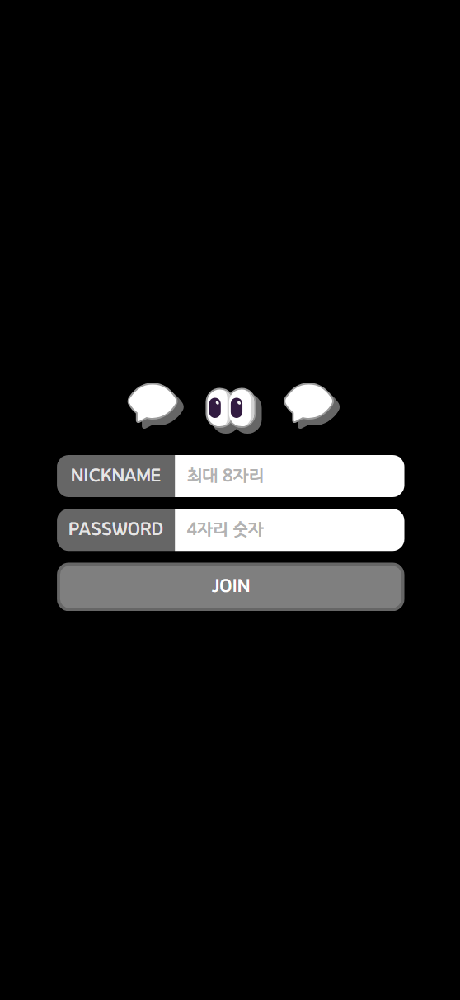
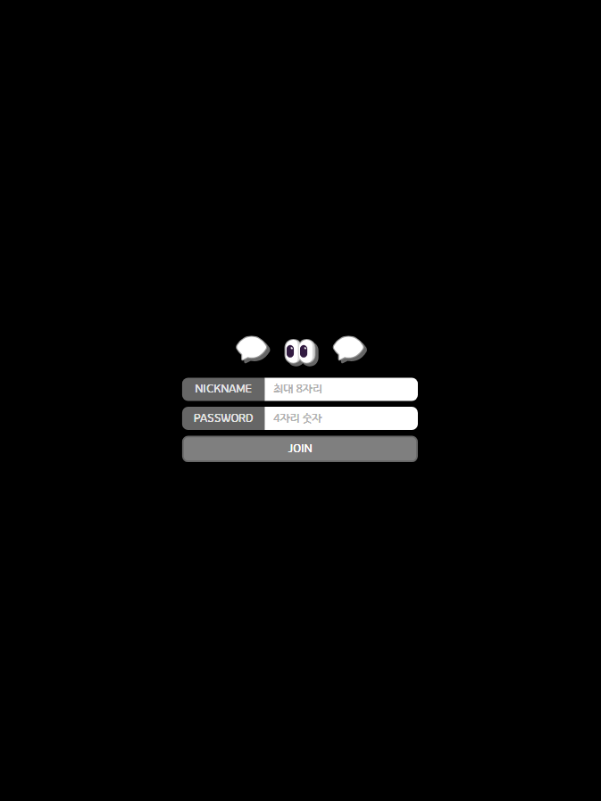
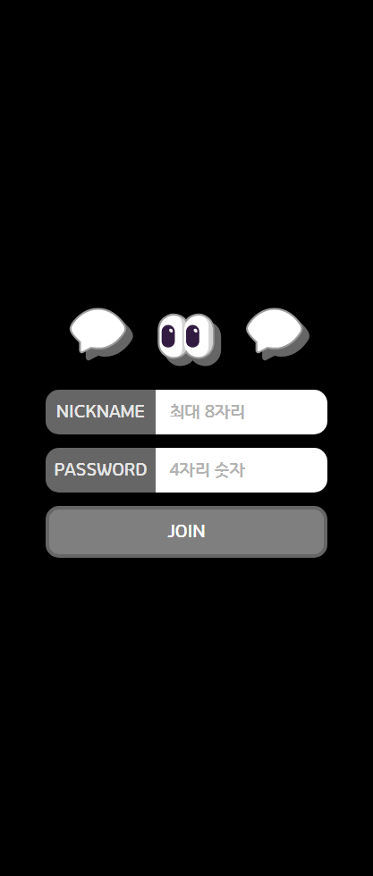
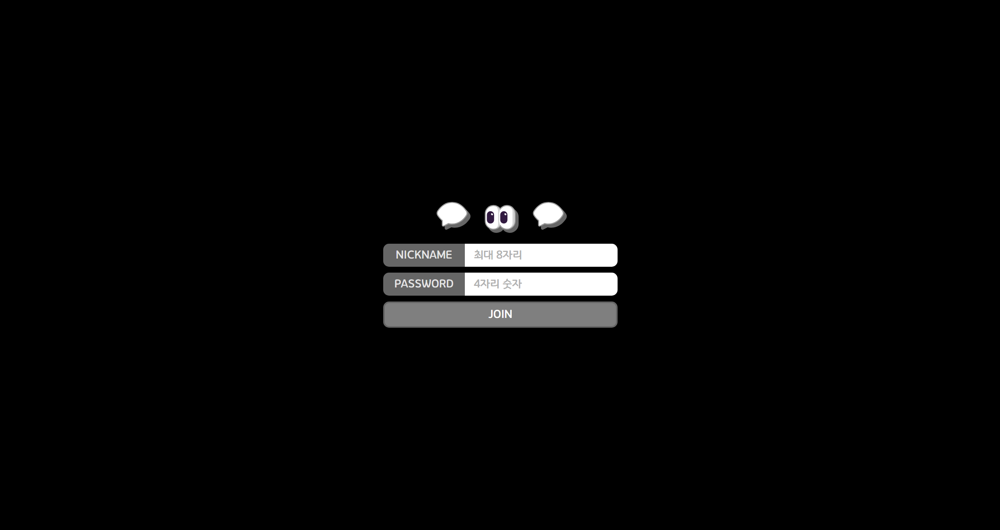
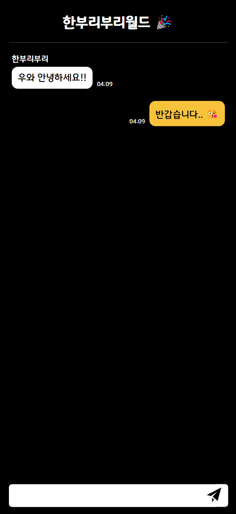
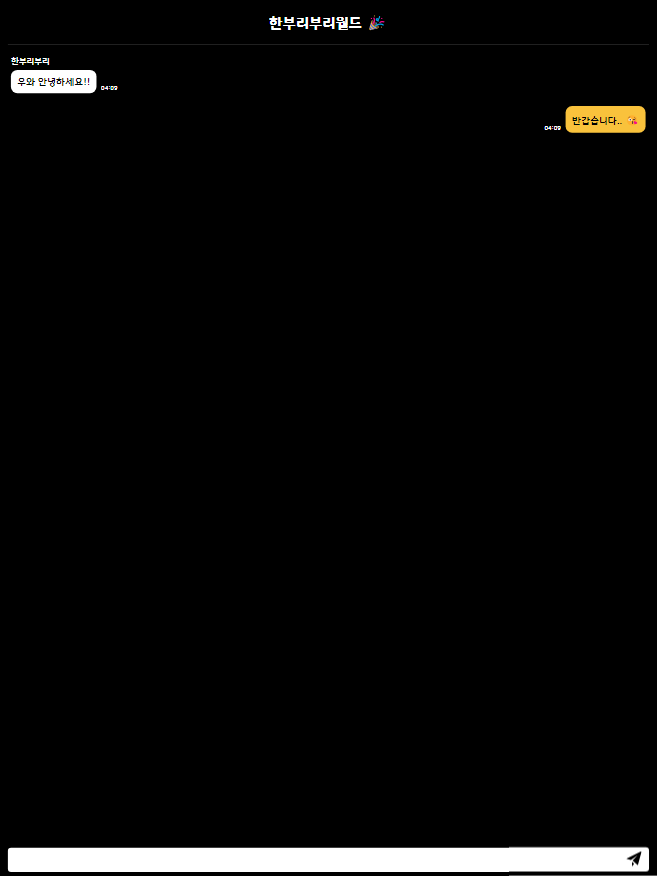
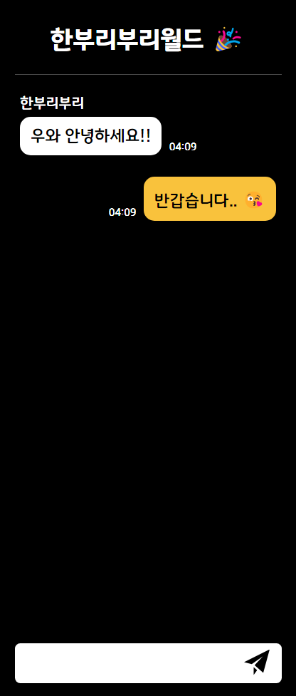
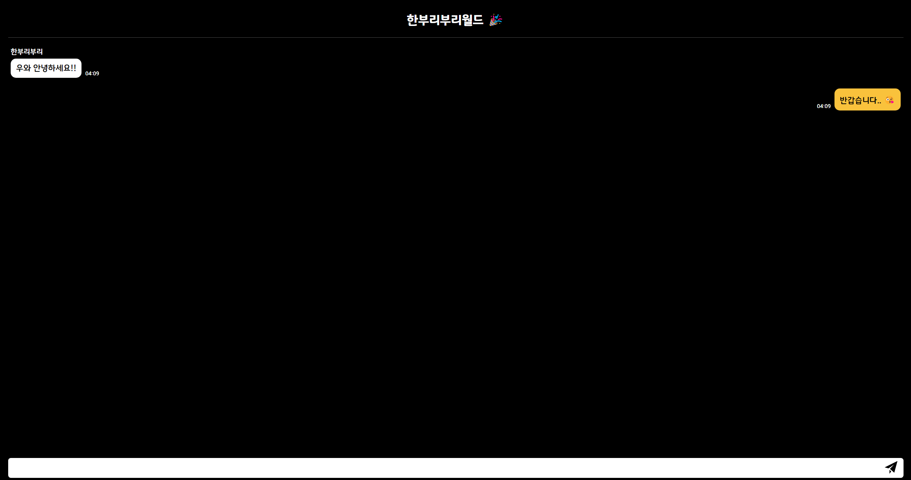

# 챗챗 💬

채팅 애플리케이션

## 개발 목적

- React + Typescript 공부
- Web Socket 공부

## 라이브러리

- react-router-dom
- styled-components
- gh-pages
- recoil

## 화면

모든 화면은 **반응형**으로 구현하였습니다.
|화면|iPhone 12 Pro|iPad Pro|Galaxy Fold|LG Gram|
|:--:|:--:|:--:|:--:|:--:|
|메인|||||
|채팅방|||||
